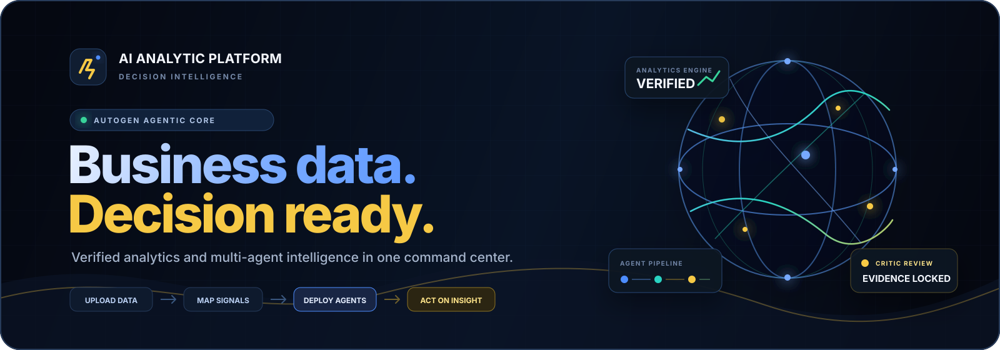
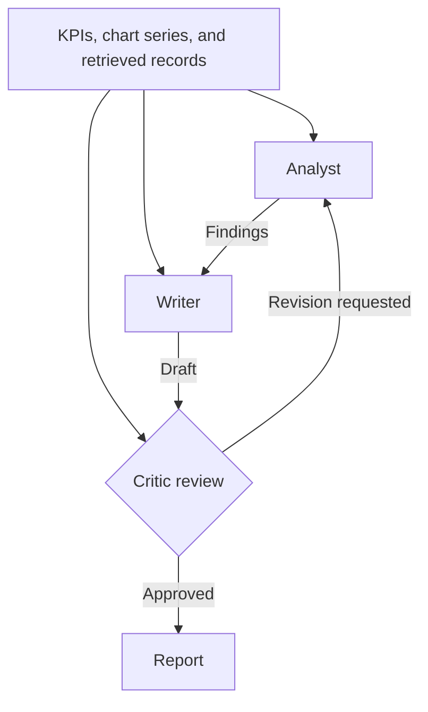
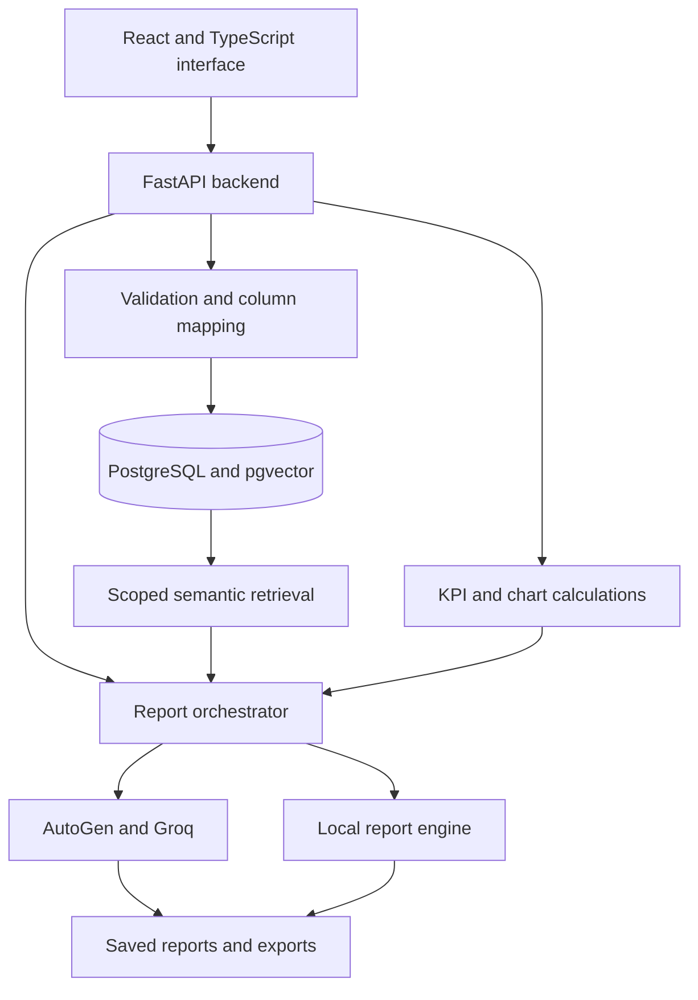

<p align="center">
  
</p>

<h1 align="center">AI Analytic Platform</h1>

<p align="center">
  <strong>From business data to executive reports, powered by three specialist AI agents.</strong>
  <br />
  Sales analytics · Marketing intelligence · PostgreSQL RAG · Automated reporting
</p>

<p align="center">
  
  
  
  
  <br />
  
  
  
  
</p>

<p align="center">
  <a href="#overview">Overview</a> ·
  <a href="#multi-agent-intelligence">AI Agents</a> ·
  <a href="#postgresql-rag">RAG</a> ·
  <a href="#architecture">Architecture</a> ·
  <a href="#getting-started">Setup</a> ·
  <a href="#deployment">Deployment</a> ·
  <a href="#api-reference">API</a>
</p>

---

## Overview

**AI Analytic Platform** is a full-stack business intelligence application that brings data ingestion, interactive analytics, semantic retrieval, and AI report generation into one workspace.

Upload sales or marketing data, map its columns, and explore revenue, product performance, regional trends, and campaign efficiency. When you generate a report, three Microsoft AutoGen agents—**Analyst, Writer, and Critic**—use calculated metrics and relevant source records to produce a structured business narrative with recommendations.

The backend calculates KPIs and chart series directly from the selected data. PostgreSQL stores business records and their vector embeddings, while retrieval supplies relevant records to all three agents. Saved reports retain their chart snapshots for later viewing, export, and printing.

<table>
  <tr>
    <td align="center"><strong>3</strong><br />Specialist AI agents</td>
    <td align="center"><strong>7</strong><br />Report modes</td>
    <td align="center"><strong>6</strong><br />Chart families</td>
    <td align="center"><strong>10,000</strong><br />Rows per upload</td>
  </tr>
</table>

## Core Capabilities

| Capability | What you can do |
|---|---|
| **Data ingestion** | Upload CSV or JSON files with validation, type detection, and editable column mapping. |
| **Interactive analytics** | Explore KPIs, trends, product contribution, regional performance, and marketing funnels. |
| **Multi-agent reporting** | Generate reports through an Analyst, Writer, and Critic workflow with a controlled revision cycle. |
| **Semantic retrieval** | Retrieve relevant business records using MiniLM embeddings stored in PostgreSQL with pgvector. |
| **Custom analysis** | Ask a business question and provide additional instructions for the report. |
| **Report workspace** | Save, search, favorite, reopen, and delete reports within your account. |
| **Export and delivery** | Download Markdown or JSON, print reports to PDF, and optionally deliver them through email or Telegram. |
| **Local reporting** | Generate deterministic reports from calculated metrics when the AI provider is unavailable or unconfigured. |

## How It Works

1. **Create an account** to access your datasets and reports.
2. **Upload a dataset** or start with the bundled sales and marketing data.
3. **Review column mappings** so the platform recognizes revenue, regions, products, campaigns, and other fields.
4. **Explore the dashboard** and select the data and filters for your analysis.
5. **Generate a report** using a predefined mode or a custom business question.
6. **Review and share the result** through saved reports, downloads, printing, or configured delivery channels.

## Multi-Agent Intelligence

The reporting pipeline uses **Microsoft AutoGen AgentChat** with Groq through an OpenAI-compatible model client. Each agent has a distinct role and receives the same source context: selected filters, calculated KPIs, chart series, rankings, and retrieved business records.

| Agent | Responsibility |
|---|---|
| **Data Analyst** | Interprets the supplied metrics and records to identify trends, leading products and regions, campaign performance, and business risks. |
| **Report Writer** | Organizes the analysis into a readable report with findings, business implications, and recommended actions. |
| **Critic** | Reviews the draft for numerical consistency, unsupported claims, clarity, and alignment with the supplied data. |



The pipeline allows **one controlled revision cycle** through analysis and writing before a final critic review. Backend calculations provide the numerical foundation; the agents interpret those results and explain their business significance.

If the AI workflow cannot complete, the report engine falls back to a local Markdown report built from the calculated metrics. Dashboard analytics and local reporting can be used without an AI API key.

## PostgreSQL RAG

Retrieval-Augmented Generation connects report generation to records from the selected business dataset.

1. **Embed records:** MiniLM creates 384-dimensional embeddings on the CPU.
2. **Persist vectors:** PostgreSQL stores embeddings in `record_embeddings.embedding` using the pgvector `vector(384)` type.
3. **Scope retrieval:** The retrieval layer restricts eligible records by authenticated owner, dataset, and active filters.
4. **Find relevant records:** Cosine similarity selects records relevant to the report request or business question.
5. **Build shared context:** Retrieved records are combined with the calculated KPI and chart snapshot and supplied to the Analyst, Writer, and Critic.

The retrieved records provide detailed context, while the analytics layer supplies aggregate metrics for the selected data. `RAG_TOP_K` controls the maximum number of retrieved source records per report and defaults to `6`.

On Render, embeddings persist in PostgreSQL across application redeploys while the database is retained. The active web backend uses PostgreSQL vector storage; the original standalone ChromaDB workflow remains available through the optional legacy dependencies.

## Architecture



The application combines a React frontend with a FastAPI backend. A multi-stage Docker build compiles the frontend and packages its assets with the Python application. FastAPI serves the interface and API from the same origin in production.

PostgreSQL supports deployed persistence and vector retrieval. SQLite is the default database for local development. Authentication scopes dataset access, report retrieval, and exports to the signed-in account.

### Technology Stack

| Layer | Technologies |
|---|---|
| Frontend | React, TypeScript, Vite |
| Backend | Python, FastAPI |
| Agent orchestration | Microsoft AutoGen AgentChat |
| Language model | Groq, configurable through `GROQ_MODEL` |
| Embeddings | MiniLM, 384-dimensional vectors, CPU inference |
| Data and vector storage | PostgreSQL, pgvector |
| Local database | SQLite |
| Authentication | Argon2 password hashing, signed session cookies |
| Packaging and hosting | Docker, Render Blueprint |
| Optional delivery | Gmail SMTP, Telegram Bot API |

## Data Hub

Data Hub accepts UTF-8 **CSV** and **JSON** files. Uploads are checked before use, and the mapping interface lets you review or correct detected fields.

| Upload setting | Supported value |
|---|---|
| File formats | `.csv`, `.json` |
| Maximum file size | 5 MB |
| Maximum rows | 10,000 |
| Maximum columns | 80 |
| JSON structure | Array of objects, or an object containing a `data`, `rows`, `records`, or `items` array |

### Smart Column Mapping

The platform normalizes headers, handles duplicate column names, detects numeric and text fields, and recognizes common business aliases.

| Uploaded column aliases | Mapped field |
|---|---|
| `net_sales`, `sales_amount`, `gmv` | `revenue` |
| `quantity`, `qty`, `volume` | `units_sold` |
| `market`, `territory`, `location` | `region` |
| `spend`, `ad_spend`, `campaign_cost` | `budget` |
| `views`, `reach`, `exposures` | `impressions` |
| `orders`, `leads`, `signups` | `conversions` |

### Sales Data

Sales datasets require a `revenue` field. Additional dimensions support product, region, category, and period analysis.

```csv
product,region,quarter,revenue,units_sold,category
Analytics Pro,North,Q1 2026,125000,84,SaaS
Growth Suite,South,Q1 2026,98000,65,SaaS
Analytics Pro,West,Q2 2026,142000,96,SaaS
```

### Marketing Data

Marketing datasets require at least one of `budget`, `impressions`, `clicks`, or `conversions`. Include the fields needed for the metrics you want to explore.

```csv
campaign_name,channel,quarter,budget,impressions,clicks,conversions
Product Launch,Email,Q1 2026,5000,120000,6200,410
Search Growth,Search,Q1 2026,12000,250000,10800,680
Brand Awareness,Social,Q2 2026,8500,310000,9400,520
```

Starter templates are also available inside Data Hub.

## Analytics Dashboard

The dashboard updates as the active dataset or filters change. Available metrics and visualizations depend on the fields present in the selected data.

| Area | Analytics |
|---|---|
| **Sales performance** | Total revenue, units sold, period movement, and quarterly trends |
| **Product performance** | Product rankings, revenue contribution, and product mix |
| **Regional performance** | Revenue by region and market contribution |
| **Marketing activity** | Budget, impressions, clicks, and conversions |
| **Campaign efficiency** | Click-through rate, conversion rate, cost per conversion, and channel-level CPA |
| **Acquisition funnel** | Movement from impressions to clicks to conversions |

The workspace includes business signals, recent reports, an active-source switcher, and a keyboard command palette accessible with **Ctrl + K** or **⌘ + K**.

## Report Studio

Choose from seven report modes or use a custom question to guide the analysis.

| Report mode | Focus |
|---|---|
| **Executive Brief** | An overview of commercial performance, key changes, risks, and priorities |
| **Sales Performance** | Revenue, units, products, regions, and sales momentum |
| **Campaign Intelligence** | Marketing spend, conversions, channel efficiency, and acquisition costs |
| **Quarterly Pulse** | Period comparisons, growth patterns, and next-quarter priorities |
| **Product Analysis** | Product contribution, revenue concentration, and opportunities |
| **Regional Analysis** | Regional performance, market mix, and expansion opportunities |
| **Ask the Data** | A custom business question with optional analysis instructions |

Example questions:

- Which products contribute most to revenue, and how concentrated is the product mix?
- Which regions account for the strongest quarter-over-quarter growth?
- Which marketing channels have the lowest cost per conversion?
- Where does the acquisition funnel show the largest drop-off?

### Visual Reports

Reports include charts when the selected data supports them.

| Chart | What it shows |
|---|---|
| **Revenue trajectory** | Revenue movement across available periods |
| **Regional contribution** | Revenue distribution across markets |
| **Product mix** | Each product's share of revenue |
| **Acquisition momentum** | Marketing spend and conversions over time |
| **Channel efficiency** | Conversion volume and cost per acquisition by channel |
| **Acquisition funnel** | Impressions, clicks, and conversions |

Each saved report retains its `chart_data` snapshot. Reopening the report restores its original chart series, and JSON exports include that snapshot. Browser printing preserves the report's KPI cards, plots, and tables.

Reports can be saved, searched, favorited, downloaded as Markdown or JSON, printed to PDF, or delivered through configured email and Telegram integrations.

## Getting Started

Run the following commands from the project root. Local development requires **Python 3.12+**, **Node.js 20+**, and **npm**.

### Option 1: Docker

Build and start the application:

```bash
docker build -t ai-analytic-platform .
docker run --rm -p 10000:10000 -e JWT_SECRET="replace-with-a-long-random-secret" ai-analytic-platform
```

Open [http://localhost:10000](http://localhost:10000), create an account, and explore the bundled data. Local reporting works without an AI API key.

To run with environment values from a configured `.env` file:

```bash
docker run --rm -p 10000:10000 --env-file .env ai-analytic-platform
```

Use a persistent PostgreSQL database through `DATABASE_URL` when you need data to survive disposable container runs.

### Option 2: Local Development

#### Start the backend

<details open>
<summary><strong>Windows PowerShell</strong></summary>

```powershell
py -m venv .venv
.\.venv\Scripts\python.exe -m pip install -r requirements-dev.txt
Copy-Item .env.example .env
.\.venv\Scripts\python.exe -m uvicorn app:app --reload --port 8000
```

</details>

<details>
<summary><strong>macOS / Linux</strong></summary>

```bash
python3 -m venv .venv
source .venv/bin/activate
pip install -r requirements-dev.txt
cp .env.example .env
uvicorn app:app --reload --port 8000
```

</details>

#### Start the frontend

Open a second terminal in the project root:

```bash
cd frontend
npm ci
npm run dev
```

| Service | Local URL |
|---|---|
| Application | [http://localhost:5173](http://localhost:5173) |
| API documentation | [http://localhost:8000/api/docs](http://localhost:8000/api/docs) |
| Health endpoint | [http://localhost:8000/api/health](http://localhost:8000/api/health) |

Vite proxies `/api` requests to the FastAPI server on port `8000`.

### Enable AI Reports

Configure the following values in `.env` and restart the backend:

```dotenv
GROQ_API_KEY=your_groq_api_key
GROQ_MODEL=llama-3.3-70b-versatile
```

AutoGen AgentChat is included in the application dependencies. `GROQ_API_KEY` enables the Analyst, Writer, and Critic workflow. Without a configured key, reports use the local report engine.

### Serve the Frontend Through FastAPI

Build the frontend from the project root:

```bash
cd frontend
npm run build
cd ..
```
Start FastAPI using the project's Python environment:
```bash
python -m uvicorn app:app --host 0.0.0.0 --port 10000
```
On Windows, use `.\.venv\Scripts\python.exe` in place of `python` if the environment is not activated. Open [http://localhost:10000](http://localhost:10000) to use the frontend and API from the same origin.
## Configuration
Use `.env.example` as the starting point for local configuration. Keep API keys and database credentials out of version control.
| Variable | Purpose | Default / usage |
|---|---|---|
| `DATABASE_URL` | Application database connection | Local SQLite by default; PostgreSQL for deployment |
| `JWT_SECRET` | Signs session tokens | Set a strong secret; generated by the Render Blueprint |
| `ENVIRONMENT` | Runtime environment | Set to `production` for production cookies and HSTS |
| `SESSION_MINUTES` | Session duration | `10080` |
| `CORS_ORIGINS` | Allowed frontend origins | Comma-separated development origins |
| `GROQ_API_KEY` | Credentials for AI report generation | Required for the AutoGen workflow |
| `GROQ_MODEL` | Model used by the agents | `llama-3.3-70b-versatile` |
| `GROQ_API_URL` | Groq-compatible chat-completions endpoint | Optional override |
| `EMBEDDING_CACHE_DIR` | Embedding model cache | `/app/.cache/fastembed` in Docker |
| `EMBEDDING_LOCAL_FILES_ONLY` | Controls model download behavior | `true` for the prefetched Docker model; `false` permits a local download |
| `EMBEDDING_BATCH_SIZE` | Records embedded per batch | `16` |
| `EMBEDDING_THREADS` | ONNX inference threads | `1` |
| `RAG_TOP_K` | Maximum retrieved records per report | `6` |
| `GMAIL_USER` | Sender account for email delivery | Optional |
| `GMAIL_APP_PASSWORD` | SMTP application password | Required for configured Gmail delivery |
| `TELEGRAM_BOT_TOKEN` | Bot credentials for Telegram delivery | Optional |
## Deployment
The repository includes a Dockerfile and a `render.yaml` Blueprint for deploying the application with PostgreSQL.
1. Push the project to GitHub.
2. In Render, select **New → Blueprint** and connect the repository.
3. Review the `ai-analytic-platform` web service and `ai-analytic-platform-db` database.
4. Add `GROQ_API_KEY` to enable AI reporting.
5. Deploy the Blueprint.
The deployment builds the frontend, installs backend dependencies, caches the MiniLM model, and runs the combined application on port `10000`. The Blueprint supplies `DATABASE_URL`, generates `JWT_SECRET`, and configures `/api/health` as the health endpoint.
Application startup enables the PostgreSQL `vector` extension and creates the required embedding and source-context tables. Stored datasets, reports, and embeddings remain in the database across web-service redeploys while the database is retained.
## Authentication and Data Access
- **Argon2 password hashing** for account credentials.
- **Signed, expiring, HTTP-only cookies** for sessions.
- **Secure cookies and HSTS** in production.
- **Account-scoped queries** for datasets, reports, exports, and vector retrieval.
- **Upload validation** for file size, row count, column count, encoding, format, and schema.
- **ORM-backed database access**, normalized filenames, and security response headers.
## API Reference
Interactive API documentation is available at [`/api/docs`](http://localhost:8000/api/docs) when running locally.
| Area | Endpoints |
|---|---|
| System | `GET /api/health` · `GET /api/system/status` |
| Authentication | `POST /api/auth/register` · `POST /api/auth/login` · `POST /api/auth/logout` · `GET /api/auth/me` |
| Dataset collection | `POST /api/datasets/upload` · `GET /api/datasets` |
| Dataset management | `GET`, `PATCH`, `DELETE /api/datasets/{id}` |
| Analytics | `GET /api/meta/options` · `GET /api/dashboard` |
| Report generation | `POST /api/reports/generate` |
| Report management | `GET /api/reports` · `GET`, `PATCH`, `DELETE /api/reports/{id}` |
| Export and delivery | `GET /api/reports/{id}/download` · `POST /api/reports/{id}/deliver` |
## Project Structure
| Path | Responsibility |
|---|---|
| `app.py` | ASGI entry point |
| `backend/main.py` | FastAPI routes and frontend serving |
| `backend/security.py` | Authentication, password hashing, and sessions |
| `backend/datasets.py` | Upload parsing, validation, and field mapping |
| `backend/analytics.py` | KPI calculations, chart series, and report context |
| `backend/embeddings.py` | MiniLM embedding generation |
| `backend/retrieval.py` | PostgreSQL vector storage and scoped retrieval |
| `backend/agent_engine.py` | AutoGen Analyst, Writer, and Critic workflow |
| `backend/report_engine.py` | Report orchestration and local fallback |
| `frontend/src/` | React application |
| `frontend/public/images/` | Interface visual assets |
| `data/` | Bundled sales and marketing datasets |
| `requirements.txt` | Production dependencies |
| `requirements-dev.txt` | Development dependencies |
| `requirements-legacy.txt` | Optional standalone Streamlit and ChromaDB dependencies |
| `Dockerfile` | Application image and frontend build |
| `render.yaml` | Render service and database configuration |
